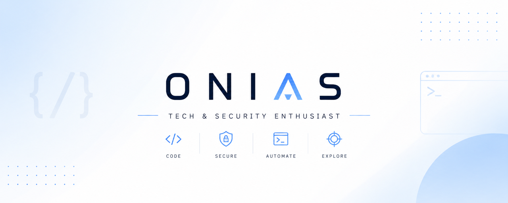

  
<pre>
    💼 B.Sc. • Passionné de Cybersécurité
    💻 Stack • React • Node.js • Java • Python 
    🛡️ Cyber • Joueur CTF (Root-Me, TryHackMe ...) • Focus Crypto & Réseau
    ⚙️ Setup • Kali Linux (Natif 🐧)
    🎮 Hobbies • Basketball and Football • Jeux de gestion/survie
</pre>
 

  
    

  
